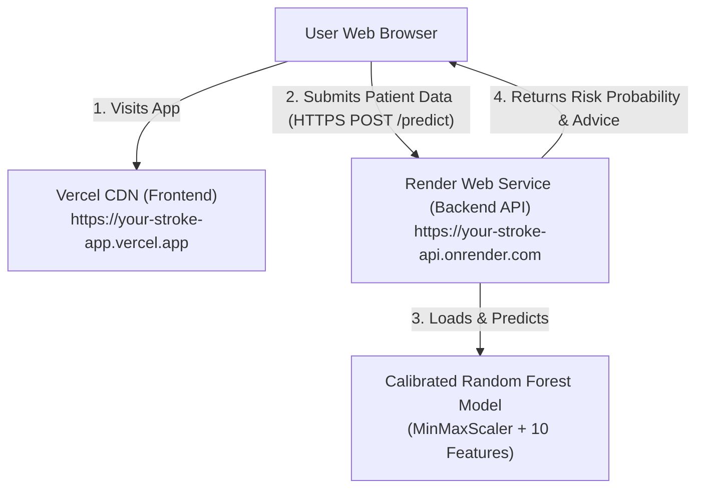

# 🚀 Production Deployment Guide: Vercel & Render

This step-by-step guide explains how to deploy the **StrokeRisk AI - Clinical Stroke Risk Predictor** application to production:
- **Backend API**: Hosted on **Render** (FastAPI + Scikit-Learn ML Model)
- **Frontend App**: Hosted on **Vercel** (Responsive Clinical UI)

---

## 🏗 Deployment Architecture



---

## 1. Deploying the Backend API to Render

Render offers free-tier hosting for Python web services with automated SSL certificates and continuous Git deployment.

### Option A: 1-Click Render Blueprint (Recommended)

1. Push your latest code to GitHub:
   ```bash
   git add .
   git commit -m "Deploy StrokeRisk AI to Render and Vercel"
   git push origin main
   ```
2. Log in to your [Render Dashboard](https://dashboard.render.com/).
3. Click **Blueprints** → **New Blueprint Instance**.
4. Select your `stroke-prediction` repository.
5. Render will detect the included `render.yaml` file automatically:
   - **Service Name**: `stroke-prediction-backend`
   - **Runtime**: `Python 3.11`
   - **Root Directory**: `backend`
   - **Build Command**: `pip install -r requirements.txt`
   - **Start Command**: `uvicorn app.main:app --host 0.0.0.0 --port $PORT`
   - **Health Check Path**: `/health`
6. Click **Apply**. Render will build and deploy the web service.
7. Once deployed, note your service URL (e.g. `https://stroke-prediction-backend.onrender.com`).

---

### Option B: Manual Web Service Creation on Render

If you prefer creating the service manually:

1. In Render Dashboard, click **New +** → **Web Service**.
2. Connect your GitHub repository.
3. Configure the service settings:
   | Setting | Value |
   |---|---|
   | **Name** | `stroke-prediction-backend` |
   | **Region** | `Oregon (US West)` or closest to your users |
   | **Branch** | `main` |
   | **Root Directory** | `backend` |
   | **Runtime** | `Python 3` |
   | **Build Command** | `pip install -r requirements.txt` |
   | **Start Command** | `uvicorn app.main:app --host 0.0.0.0 --port $PORT` |
   | **Instance Type** | `Free` |
4. Under **Advanced** settings:
   - **Health Check Path**: `/health`
   - **Environment Variables**:
     - `PYTHON_VERSION`: `3.11.0`
     - `ALLOWED_ORIGINS`: `*` (or your specific Vercel URL e.g. `https://your-app.vercel.app`)
5. Click **Create Web Service**.

> [!NOTE]
> **Render Free Tier Cold Starts**: Render's free instances spin down after 15 minutes of inactivity. When a new request arrives, it takes ~30–45 seconds to spin up. The frontend includes a built-in notification alerting the user during wake-up.

---

## 2. Deploying the Frontend to Vercel

Vercel provides edge caching, global CDN distribution, and instant deployments.

### Step 1: Set the Environment Variable in Vercel
When importing your repository into Vercel (or in **Project Settings** → **Environment Variables**):
1. Add an Environment Variable:
   - **Key**: `BACKEND_URL`
   - **Value**: `https://your-backend-service.onrender.com` (your deployed Render API URL)
   - **Environments**: Select `Production`, `Preview`, and `Development`
2. Save the variable.

> [!TIP]
> **Zero Hardcoding**: The frontend dynamically reads this variable both at build time (via `build.js` / `config.js`) and at runtime (via Vercel Serverless Function `/api/config`). No backend URLs are ever hardcoded in the frontend!

### Step 2: Deploy via Vercel Dashboard or CLI

#### Via Vercel Web Dashboard (Recommended)
1. Log in to your [Vercel Dashboard](https://vercel.com/dashboard).
2. Click **Add New…** → **Project**.
3. Import your GitHub repository (`stroke-prediction`).
4. In the configuration screen:
   - **Framework Preset**: `Other`
   - **Root Directory**: `./` (the root `vercel.json` routes to `/frontend` automatically) OR select `frontend`.
   - **Build Command**: `node build.js` (automatically configured in `vercel.json`)
   - **Environment Variables**: Add `BACKEND_URL = https://your-backend.onrender.com`
5. Click **Deploy**.
6. Within seconds, your app is live on Vercel and automatically communicates with your Render backend!

#### Via Vercel CLI
```bash
npm install -g vercel
vercel env add BACKEND_URL production
vercel --prod
```

---

## 3. Verifying the Connection

1. Open your deployed Vercel application in your browser (`https://your-app.vercel.app`).
2. The navbar status pill in the top-right will automatically detect the backend and turn green:
   ```text
   🟢 Cloud (140ms)
   ```
3. To view or test latency, click the pill or **⚙️ Settings Icon** to open the Backend API Configuration drawer.
4. Click **Test Connection** to verify end-to-end model responsiveness.


---

## 4. Local Development

To run both services locally on your development machine:

### Backend (Terminal 1)
```bash
cd backend
python -m venv .venv
# Windows:
.venv\Scripts\activate
# macOS/Linux:
# source .venv/bin/activate

pip install -r requirements.txt
uvicorn app.main:app --reload --port 8000
```
Backend API will be live at: [http://localhost:8000](http://localhost:8000) (Swagger docs at `/docs`).

### Frontend (Terminal 2)
```bash
python -m http.server 3000 --directory frontend
```
Frontend will be live at: [http://localhost:3000](http://localhost:3000).

---

## 5. Automated Tests

Run the test suite before deploying to verify endpoints, feature scaling, and inference:

```bash
python -m pytest backend/tests/test_api.py -v
```

Expected output:
```text
backend/tests/test_api.py::test_root_endpoint PASSED
backend/tests/test_api.py::test_health_endpoint PASSED
backend/tests/test_api.py::test_predict_low_risk_profile PASSED
backend/tests/test_api.py::test_predict_high_risk_profile PASSED
backend/tests/test_api.py::test_predict_validation_error PASSED
backend/tests/test_api.py::test_cors_preflight_or_origin PASSED
6 passed in 2.5s
```
