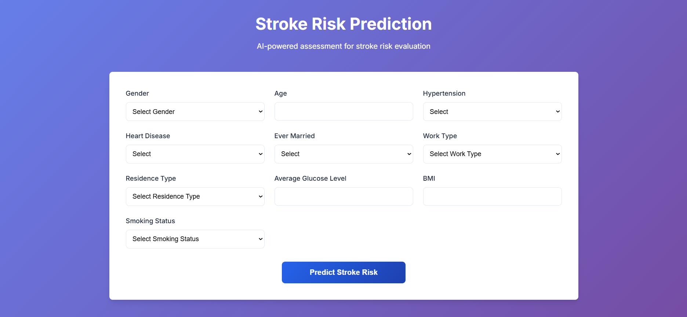
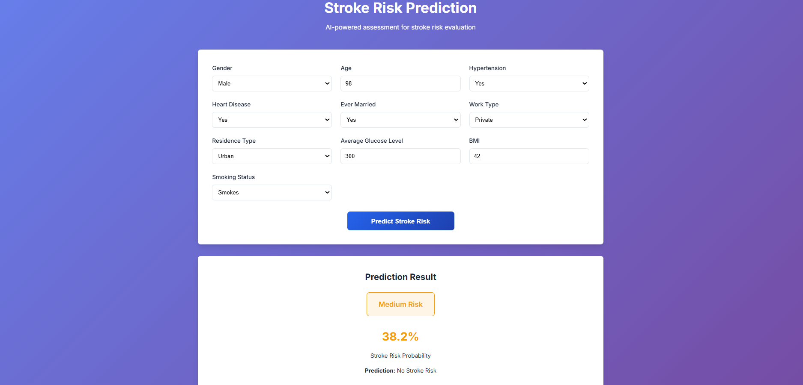

# 🧠 Stroke Prediction App

[](https://github.com/SatyaTejaChukka/stroke-prediction)  
[](https://www.python.org/)  
[](https://fastapi.tiangolo.com/)  
[](https://www.docker.com/)  
[](https://aws.amazon.com/)  

A **full-stack Machine Learning application** that predicts **stroke risk** based on patient health data.

Built with:  
- **FastAPI** backend API  
- Interactive **HTML/CSS/JS** frontend with animated gradients & Lottie animations  
- Docker containerization  
- AWS Elastic Beanstalk and S3 cloud deployment  

---

## 📑 Table of Contents
1. [📂 Project Structure](#-project-structure)  
2. [✨ Features](#-features)  
3. [🛠 Tech Stack](#-tech-stack)  
4. [🚀 Local Development Guide](#-local-development-guide)  
5. [🌐 API Documentation](#-api-documentation)  
6. [⚙️ Environment Variables](#️-environment-variables)  
7. [☁ AWS Deployment Instructions](#-aws-deployment-instructions)  
8. [📸 Screenshots / Demo](#-screenshots--demo)  
 

---

## 📂 Project Structure

```plaintext
stroke_prediction_app/
├── backend/                # FastAPI backend & ML model
│   ├── app/                # API source code
│   ├── model/              # ML model file (model.pkl)
│   ├── requirements.txt
│   ├── Dockerfile
│   ├── .env                 # Local environment variables (not committed)
│   ├── .gitignore
│   └── README.md            # Backend docs
│
├── frontend/                # Responsive HTML/CSS/JS frontend
│   ├── index.html
│   ├── styles.css
│   ├── script.js
│   ├── assets/              # Images, Lottie animations
│   └── README.md            # Frontend docs
│
└── README.md                # This file
```

---

## ✨ Features

- **Machine Learning Model**: Random Forest classification predicting stroke risk  
- **Backend API**: FastAPI endpoints `/predict` and `/health` with CORS enabled  
- **Responsive Frontend**: Modern UI with animated gradients and Lottie animations  
- **Containerized Deployment**: Docker support for easy AWS deployment  
- **Cloud Ready**: Deployment instructions for AWS Elastic Beanstalk and S3  
- **Secure & Scalable**: Production-ready setup with health checks and environment configs  

---

## 🛠 Tech Stack

**Frontend**  
- HTML5, CSS3, Vanilla JavaScript  
- Animated CSS gradients

**Backend**  
- Python 3.11, FastAPI, Uvicorn, Pydantic  
- scikit-learn, numpy, pandas  

**Deployment**  
- Docker containerization  
- AWS Elastic Beanstalk (backend)  
- AWS S3 + CloudFront (frontend hosting)  

---

## 🚀 Local Development Guide

### Clone repo
```bash
git clone https://github.com/SatyaTejaChukka/stroke-prediction.git
cd stroke-prediction
```

### Backend setup
```bash
cd backend
python -m venv .venv
.venv\Scripts\activate         # MacOS : source .venv/bin/activate
pip install -r requirements.txt
uvicorn app.main:app --reload  # Runs backend at http://127.0.0.1:8000
```

### Frontend setup
Open `frontend/index.html` in a browser directly or serve with a simple HTTP server:
```bash
cd frontend
python -m http.server 8080  # Runs frontend at http://127.0.0.1:8080
```

---

## 🌐 Live Deployment

The application is deployed on AWS and accessible at:

- **Frontend**: [http://stroke-prediction-frontend.s3-website.eu-north-1.amazonaws.com](http://stroke-prediction-frontend.s3-website.eu-north-1.amazonaws.com)  
- **Backend API Docs**: [http://stroke-backend-env.eba-d2shsa58.us-west-2.elasticbeanstalk.com/docs](http://stroke-backend-env.eba-d2shsa58.us-west-2.elasticbeanstalk.com/docs)  

---

## 🌐 API Documentation

FastAPI includes interactive docs:

- Swagger UI: [http://localhost:8000/docs](http://localhost:8000/docs)  
- ReDoc: [http://localhost:8000/redoc](http://localhost:8000/redoc)  

### Endpoints
- `GET /health`: Returns API status  
- `POST /predict`: Accepts patient data and returns stroke prediction  

Example request body:
```json
{
  "gender": 0,
  "age": 45.0,
  "hypertension": 0,
  "heart_disease": 0,
  "ever_married": 1,
  "work_type": 3,
  "Residence_type": 1,
  "avg_glucose_level": 95.5,
  "bmi": 28.1,
  "smoking_status": 1
}
```

Example response:
```json
{
  "stroke": 0
}
```

---

## ⚙️ Environment Variables

Create a `.env` file inside `backend/` for local development (do not commit secrets):

```env
MODEL_PATH=./model/model.pkl
ALLOWED_ORIGINS=*
PORT=8000
```

---

## ☁ AWS Deployment Instructions

### Backend: Elastic Beanstalk with Docker

1. Install EB CLI:
```bash
pip install awsebcli
```

2. Initialize Elastic Beanstalk environment:
```bash
cd backend
eb init -p docker stroke-prediction-app
```

3. Create environment and deploy:
```bash
eb create stroke-backend-env
eb deploy
```

4. Open deployed backend API:
```bash
eb open
```

---

### Frontend: AWS S3 Static Website

1. Create an S3 bucket and enable static website hosting.  
2. Upload `index.html`, `styles.css`, `script.js`, and `assets/`.  
3. Update `frontend/script.js` → set `API_BASE_URL` to your Elastic Beanstalk backend URL.  
4. Make files public or serve via CloudFront for HTTPS.

---

## 📸 Screenshots / Demo



---

