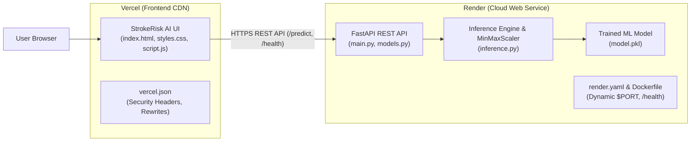

# 🧠 StrokeRisk AI | Clinical Stroke Risk Predictor

[](https://github.com/SatyaTejaChukka/stroke-prediction)
[](https://vercel.com)
[](https://render.com)
[](https://www.python.org/)
[](https://fastapi.tiangolo.com/)
[](https://scikit-learn.org/)
[](https://www.docker.com/)
[](backend/tests/test_api.py)

A **full-stack Machine Learning clinical decision support platform** that predicts **cerebrovascular stroke risk** from patient biometrics, lifestyle factors, and metabolic indicators.

---

## 🌟 Highlights & Features

- **Calibrated Machine Learning Engine**: Random Forest classification model trained on the Kaggle Stroke Prediction dataset, calibrated with `MinMaxScaler` feature transformations.
- **Explainable Clinical Insights**: Identifies primary risk drivers (e.g. hyperglycemia, arterial hypertension, advanced age tier, elevated BMI) and provides evidence-based preventative guidance.
- **Modern Medical Tech Frontend**: High-contrast dark clinical aesthetic with glassmorphism, animated circular risk gauges, biometrics sliders with real-time classification, and one-click quick presets.
- **Production Cloud Architecture**: Ready for 1-click deployment with the **Frontend on Vercel** and the **Backend API on Render**.
- **Resilient Connectivity**: Dynamic API base URL resolution, latency indicator, in-app configuration modal, and Render free-tier cold start handling.
- **Automated Test Coverage**: Comprehensive `pytest` test suite verifying endpoints, validation, and feature scaling.

---

## 🏗 Architecture


```mermaid
flowchart LR
    subgraph Vercel["Vercel (Frontend CDN)"]
        UI["StrokeRisk AI UI\n(index.html, styles.css, script.js)"]
        VercelConfig["vercel.json\n(Security Headers, Rewrites)"]
    end

    subgraph Render["Render (Cloud Web Service)"]
        API["FastAPI REST API\n(main.py, models.py)"]
        Inference["Inference Engine & MinMaxScaler\n(inference.py)"]
        Model["Trained ML Model\n(model.pkl)"]
        RenderBlueprint["render.yaml & Dockerfile\n(Dynamic $PORT, /health)"]
    end

    Browser["User Browser"] --> UI
    UI -->|"HTTPS REST API (/predict, /health)"| API
    API --> Inference
    Inference --> Model
```

---

## 📂 Project Structure

```plaintext
stroke-prediction/
├── render.yaml              # Render Blueprint (Infrastructure-as-Code)
├── vercel.json              # Vercel routing & security configuration
├── Dockerfile               # Root Docker container specification
├── DEPLOYMENT.md            # Complete Vercel & Render deployment guide
├── README.md                # Project documentation
│
├── backend/                 # FastAPI ML Backend
│   ├── app/
│   │   ├── main.py          # FastAPI application, CORS, health checks
│   │   ├── models.py        # Pydantic v2 schemas & OpenAPI documentation
│   │   └── inference.py     # Model loader, MinMaxScaler, explainability engine
│   ├── model/
│   │   └── model.pkl        # Trained Random Forest classifier
│   ├── tests/
│   │   └── test_api.py      # Pytest automated API test suite
│   ├── Dockerfile           # Backend container build specification
│   ├── requirements.txt     # Python dependencies
│   └── README.md
│
├── frontend/                # Responsive Clinical Web App
│   ├── index.html           # Semantic HTML5 clinical interface
│   ├── styles.css           # Modern clinical design system & dark theme
│   ├── script.js            # Dynamic API client, gauge animation, modal logic
│   └── vercel.json          # Subdirectory Vercel deployment configuration
│
└── notebooks/               # Model training & exploratory data analysis
    └── stroke_prediction.ipynb
```

---

## 🚀 Quick Local Setup

### 1. Clone the repository
```bash
git clone https://github.com/SatyaTejaChukka/stroke-prediction.git
cd stroke-prediction
```

### 2. Run the Backend API
```bash
cd backend
python -m venv .venv
# Windows:
.venv\Scripts\activate
# macOS/Linux:
# source .venv/bin/activate

pip install -r requirements.txt
uvicorn app.main:app --reload --port 8000
```
- API Root: [http://localhost:8000](http://localhost:8000)
- Interactive Swagger UI: [http://localhost:8000/docs](http://localhost:8000/docs)
- Interactive ReDoc: [http://localhost:8000/redoc](http://localhost:8000/redoc)

### 3. Run the Frontend
In a new terminal:
```bash
python -m http.server 3000 --directory frontend
```
- Open [http://localhost:3000](http://localhost:3000) in your browser.

---

## 🧪 Automated Testing

Run the automated test suite with `pytest`:

```bash
python -m pytest backend/tests/test_api.py -v
```

```text
backend/tests/test_api.py::test_root_endpoint PASSED           [ 16%]
backend/tests/test_api.py::test_health_endpoint PASSED         [ 33%]
backend/tests/test_api.py::test_predict_low_risk_profile PASSED[ 50%]
backend/tests/test_api.py::test_predict_high_risk_profile PASSED[ 66%]
backend/tests/test_api.py::test_predict_validation_error PASSED[ 83%]
backend/tests/test_api.py::test_cors_preflight_or_origin PASSED[100%]
======================== 6 passed in 2.5s ========================
```

---

## ☁️ Production Deployment

See the detailed **[DEPLOYMENT.md](DEPLOYMENT.md)** for complete step-by-step instructions.

### Summary:
1. **Backend on Render**:
   - Push code to GitHub.
   - In Render Dashboard, click **Blueprints** → select this repo.
   - Render detects `render.yaml` and deploys the FastAPI service with health checks automatically.
2. **Frontend on Vercel**:
   - In Vercel Dashboard, import this repo.
   - Vercel detects `vercel.json` and deploys globally with edge caching.
3. **Connect**:
   - Open your Vercel app, click **⚙️ Settings**, enter your Render backend URL, and click **Test Connection** & **Save**.

---

## 🌐 API Endpoints

### `GET /health`
Returns system status, model readiness, uptime, and environment details.

### `POST /predict`
Evaluates patient biometrics and returns stroke risk probability, risk category, detected risk factors, and clinical recommendations.

**Sample Request Body:**
```json
{
  "gender": "Male",
  "age": 78.0,
  "hypertension": 1,
  "heart_disease": 1,
  "ever_married": 1,
  "work_type": "Self-employed",
  "residence_type": "Urban",
  "avg_glucose_level": 240.5,
  "bmi": 38.2,
  "smoking_status": "smokes"
}
```

**Sample Response Body:**
```json
{
  "prediction": 1,
  "probability": 0.763,
  "risk_level": "High",
  "risk_factors": [
    "Patient age (78 yrs) is a dominant clinical risk multiplier (risk doubles every decade after 55)",
    "Markedly high blood glucose (240.5 mg/dL) indicates severe hyperglycemia/diabetes risk",
    "Diagnosed hypertension (arterial hypertension is the single most modifiable stroke risk factor)",
    "Pre-existing heart disease history (elevates risk of embolic/cardioembolic stroke)",
    "BMI of 38.2 kg/m² corresponds to clinical obesity, contributing to metabolic syndrome",
    "Active cigarette smoking promotes endothelial damage, thrombosis, and arterial stiffening"
  ],
  "recommendations": [
    "Promptly schedule a comprehensive cardiovascular and neurological evaluation with a physician.",
    "Target strict arterial blood pressure control (standard guideline: < 130/80 mmHg or as prescribed).",
    "Conduct comprehensive laboratory diagnostics: fasting plasma glucose, HbA1c, and complete lipid profile.",
    "Inquire with your physician regarding antiplatelet therapy and carotid artery duplex sonography.",
    "Review the FAST mnemonic with household members: Face drooping, Arm weakness, Speech difficulty, Time to call emergency services."
  ],
  "timestamp": "2026-09-06T10:00:00.000000+00:00"
}
```

---

## 📜 License & Medical Disclaimer

This project is licensed under the MIT License.

> **Medical Disclaimer**: This application is built as an educational demonstration and clinical decision-support tool powered by machine learning. It is not intended to serve as a substitute for professional medical advice, diagnosis, or treatment.
